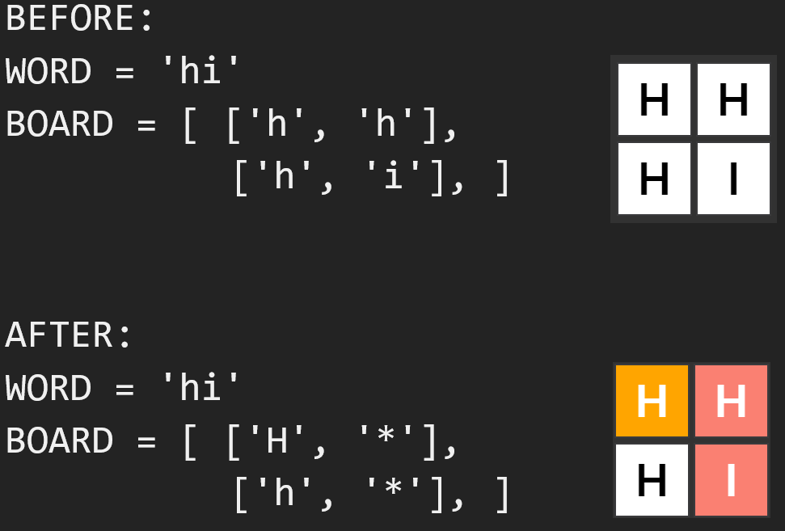
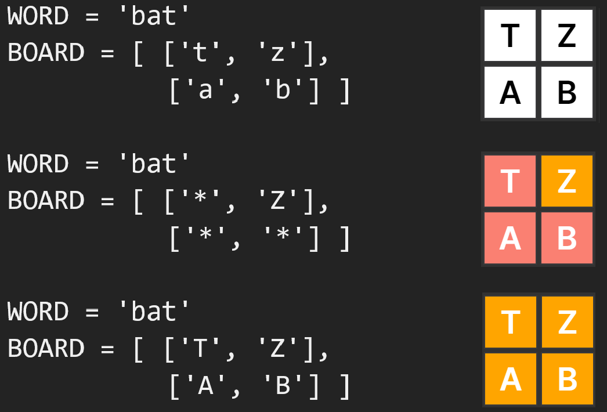
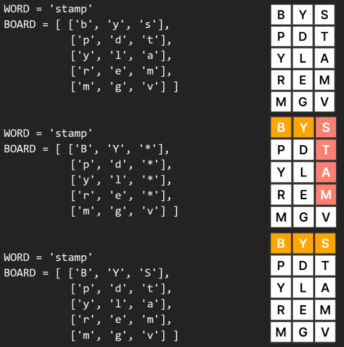

# Word Search Visualizer

Visualizes a Depth First Search algorithm with a grid of letters. The algorithm will search for a word recursively at each square. Words are made by letters that are adjacent horizontally or vertically. 

## How To Use

Visit the GitHub Page: https://rodeorhodia.github.io/WordSearchVisualizer/

## Key Features

* Play Demo
    - Searches for the word "VEGAN" in a grid of letters and displays the result.
* Build Board
    - Prompts user to enter a dimension of grid (number of rows and columns).
    - Prompts user to enter a word.
    - Prompts user to customize the grid of letters.
    - Algorithm processes a grid of letters created by user. The algorithm searches for a word (given by the user) in the grid.
* Depth First Search Algorithm
    - Backtracks if word is not found in given path.
* Recursion is implemented with synchronous programming
    - Implemented with JavaScript's async, await, and promises. These  tools requires recursion calls to wait for everything that precedes it to finish executing (i.e. works in a delayed fashion).
    - Without this implementation, the user interface would highlight squares instantaneously.
* Optimized Memory Complexity
    - The interface displays squares of three different colors. Each color represents a 'state'. The grid saves memory by storing the three states in one 'cell' (this is explained further in Examples section).
* Client-Side Form Validation
    - User can only enter a fixed set of dimensions (bounded by a 1x1 to 7x7 grid) to stop one from entering large sets of data.
    - The word that will be searched for must be in the alphabet (no numbers or symbols).
    - The word and grid of letters entered is not case sensitive, it is all converted to lowercase letters.

## Examples

Examples below show the three different states a square can be in. Memory Complexity is optimized because three different states are stored in one cell.
 * White
    - Unprocessed Square, has not been checked if it can be a starting point for a DFS call.
    - **Stored as a lowercase letter in 2D array.**
 * Orange
    - Processed Square, has been checked if it can be a starting point for a DFS call.
    - **Stored as an uppercase letter in 2D array.**
 * Salmon Pink
    - Visited, marked as a current path and is a matching letter in word.
    - **Stored as an asterick in 2D array.**

### Example 1: Word is found

### Example 2: Word not found, backtrack

### Example 3: Word not found, backtracking from unprocessed squares.

## Credits

Much thanks to these resources which helped me build this project!

* Built grid using Wordle Clone interface: https://www.youtube.com/watch?v=j7OhcuZQ-q8
* Inspired by Leetcode Word Search problem: https://leetcode.com/problems/word-search/
* How I implemented a synchronous for-loop with delay: https://stackoverflow.com/questions/63528474/nested-for-loop-delay-on-each-loop-individually
* How I implemented recursion with sleep, await, and async: https://stackoverflow.com/questions/65875198/recursive-settimeout-with-async-await
